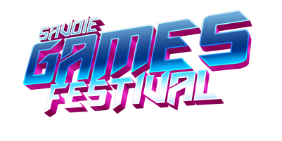

# Plan de la conférence : "FPGA et Rétro Gaming : Préserver le Passé avec Précision"

 <!-- Placeholder pour le logo, remplacer "path/to/logo.png" par le chemin réel du logo -->

## Table des matières
1. [Introduction et Objectifs de la Conférence](#1-introduction-et-objectifs-de-la-conférence-2-minutes)
2. [Lexique et Concepts Clés du FPGA](#2-lexique-et-concepts-clés-du-fpga-5-minutes)
3. [FPGA vs Émulation Logicielle : Deux approches, Deux visions](#3-fpga-vs-émulation-logicielle--deux-approches-deux-visions-15-minutes)
   - [Émulation Logicielle : Une approche orientée utilisateur](#-émulation-logicielle--une-approche-orientée-utilisateur)
   - [FPGA : Une approche orientée hardware](#-fpga--une-approche-orientée-hardware)
   - [Différences entre l’émulation logicielle et le FPGA](#-différences-entre-lémulation-logicielle-et-le-fpga)
4. [Aspects pratiques : Setup et coûts des solutions FPGA](#4-aspects-pratiques--setup-et-coûts-des-solutions-fpga-5-minutes)
5. [Processus de développement d'un Core FPGA - Exemple de Q*bert](#5-processus-de-développement-dun-core-fpga--exemple-de-qbert-15-minutes)
6. [Perspective de l'utilisateur final](#6-perspective-de-lutilisateur-final-10-minutes)
7. [Session de Questions-Réponses](#7-session-de-questions-réponses-10-minutes)

## 1. Introduction et Objectifs de la Conférence (2 minutes)
- **Présentation des intervenants** :
  - Matt (modérateur) : Développeur logiciel et utilisateur expérimenté du Mister FPGA.
  - Pierco (développeur de cores FPGA) : Contributeur actif au projet Mister FPGA, notamment avec le développement de cores comme celui de Q*bert.
  - Lars (utilisateur du Mister FPGA) : Utilisateur final, passionné de rétro gaming, qui apportera son point de vue d’utilisateur.

- **Introduction générale** :
  La conférence explore comment le FPGA est utilisé pour la préservation du rétro gaming. Nous allons comparer l'approche FPGA à l'émulation logicielle, expliquer le processus de développement d'un core sur FPGA, et discuter des avantages pour les utilisateurs finaux, avec un focus particulier sur le Mister FPGA. L'objectif est de montrer comment le FPGA peut fournir une expérience de jeu fidèle et authentique, proche des consoles et machines d'origine.

## 2. Lexique et Concepts Clés du FPGA (5 minutes)
- **Lexique des termes essentiels** :
  - **FPGA (Field-Programmable Gate Array)** : Un circuit intégré programmable qui permet de recréer fidèlement le comportement d'un hardware spécifique (comme une console ou une machine d'arcade).
  - **Core** : Un module FPGA qui émule une machine ou un système spécifique (ex. : un core pour une console ou un jeu d'arcade).
  - **ROM** : Le fichier contenant les données originales du jeu ou de l’application, qui est injecté dans le core pour être exécuté par le FPGA.
  - **BRAM (Block RAM)** : Une mémoire rapide intégrée dans les FPGA, utilisée pour stocker des données temporaires. Elle est limitée en taille, mais essentielle pour certains types d’implémentations matérielles.
  - **DSP Blocks (Digital Signal Processing)** : Blocs de calcul dédiés à des opérations mathématiques spécifiques, notamment dans le traitement de signaux numériques. Ils aident à optimiser le fonctionnement de certains cores, mais ne sont pas centraux dans le développement des cores FPGA pour le rétro gaming.

- **Importance des termes pour la conférence** :
  Ce lexique est essentiel pour aligner le vocabulaire entre les différents intervenants et l'audience, afin d’éviter toute confusion pendant la présentation. Les termes comme "core" et "FPGA" seront fréquemment utilisés pour expliquer les processus de développement et de portage des systèmes sur Mister FPGA.

## 3. FPGA vs Émulation Logicielle : Deux approches, Deux visions (15 minutes)

### - **Émulation Logicielle : Une approche orientée utilisateur** :
  - **Explication du concept** :
    L’émulation logicielle se concentre sur la **reproduction du résultat final** perçu par l’utilisateur. Le développeur d’un émulateur ne cherche pas nécessairement à recréer le hardware, mais plutôt à s'assurer que le jeu ou le système **fonctionne visuellement et auditivement de la même manière** que l'original, du point de vue de l’utilisateur.
  
  - **Processus de développement** :
    Le développeur d'émulation logicielle commence par analyser **le rendu final** (graphismes, sons, interactions) et cherche à les reproduire à travers un logiciel moderne, quel que soit le hardware sous-jacent. Cela signifie qu’il peut :
    - Interpréter et traduire les commandes du jeu ou du système en utilisant les capacités du CPU moderne (ordinateur ou Raspberry Pi).
    - Adapter les performances du système d'origine en les optimisant pour que l’émulation fonctionne sur différentes configurations, en ajustant le code pour s’adapter à la puissance de calcul disponible.
    - Ne pas reproduire les **composants internes spécifiques** du hardware (comme les circuits logiques, les registres ou les mémoires statiques), mais plutôt trouver des équivalents logiciels qui rendent le même résultat visuel et sonore.

  - **Exemple de l'émulation de la Super Nintendo** :
    Dans le cas de l’émulation logicielle de la **Super Nintendo**, le développeur va s'assurer que les jeux se chargent correctement, que les graphismes et les sons sont fidèles à l'original, et que les commandes répondent bien. Cependant, certains détails du hardware (comme la latence des entrées ou les timings précis) peuvent différer légèrement en fonction des capacités du CPU moderne et des ajustements effectués pour que le jeu fonctionne correctement sur différentes plateformes.

### - **FPGA : Une approche orientée hardware** :
  - **Explication du concept** :
    Le FPGA vise à reproduire **fidèlement le hardware original** d'une machine de jeu ou d'un système d'arcade, au niveau des composants physiques. Cette approche repose sur la recréation du comportement exact de chaque élément du hardware (comme des processeurs, des circuits logiques et des mémoires), pour que la machine se comporte **comme si elle était l'originale**.

    Cependant, bien que le FPGA permette de viser une reproduction exacte (cycle accurate) du hardware, il est également possible de produire des implémentations qui ne sont pas fidèles. Par exemple, certaines machines recréées en FPGA peuvent tourner plus rapidement que les originales ou produire des sons légèrement différents en fonction des limitations ou des optimisations appliquées.

  - **Avantage supplémentaire : Flexibilité des sorties vidéo et audio** :
    Un des avantages majeurs du FPGA est la **reproduction exacte des signaux vidéo et audio** d’origine. Cela permet d’utiliser à la fois des écrans modernes et des **écrans cathodiques d'époque (CRT)** sans avoir besoin de **traduire ou adapter** les signaux vidéo. Le FPGA permet de reproduire les résolutions et les timings vidéo originaux, et avec une interface adaptée, un joueur peut donc connecter un système FPGA à un CRT pour une expérience encore plus authentique. De même, les signaux audio sont gérés **directement par les cores**, sans traitement ou conversion intermédiaire, assurant une sortie sonore aussi proche que possible du matériel d'origine.

  - **Processus de développement** :
    Le développeur FPGA part des **datasheets** et des spécifications techniques du hardware qu’il souhaite reproduire. Il va recréer chaque composant en utilisant des langages de description de matériel, comme le **Verilog** ou le **VHDL**, sans se préoccuper du résultat visuel ou sonore final avant d'avoir tout reconstitué. Ce processus se fait étape par étape :
    - Reproduction des **circuits logiques** qui traitent les instructions et contrôlent les processus internes.
    - Simulation des **mémoires** et autres composants périphériques.
    - Chaque bloc hardware est ensuite testé indépendamment avant d'être connecté aux autres éléments.

  - **Découverte du résultat final** :
    Une fois que tous les blocs du hardware sont en place, le développeur injecte la **ROM** originale du jeu. À ce moment-là, il découvre souvent le rendu final du jeu ou du système pour la première fois. Contrairement à un développeur d'émulateur logiciel, il n’a pas besoin de vérifier le rendu à chaque étape : il se concentre sur la recréation précise des composants matériels.
  
  - **Exemple de la Super Nintendo en FPGA** :
    Dans le cas de la **Super Nintendo** implémentée sur FPGA, chaque composant du hardware est recréé, y compris le CPU, les circuits graphiques et les contrôleurs. L'objectif est de reproduire le fonctionnement original de la console de manière exacte (cycle accurate), mais il est aussi possible que certains cores FPGA ne respectent pas totalement ces standards, notamment dans les systèmes où des optimisations ou des ajustements sont appliqués.

### - **Différences entre l’émulation logicielle et le FPGA** :
  - **Approche matérielle vs approche logicielle** :
    - L'émulation logicielle se concentre sur la reproduction du **résultat final** (graphismes, sons), tandis que le FPGA tente de reproduire fidèlement **chaque composant du hardware** original. L’approche FPGA est donc une reproduction idéalement exacte au niveau matériel (cycle accurate), tandis que l’émulation peut être une approximation.
  
  - **Test et validation** :
    - Le développeur d'émulateur logiciel teste régulièrement le résultat visuel et sonore au cours du développement pour s'assurer que tout fonctionne correctement. En revanche, le développeur FPGA se concentre sur la reproduction du hardware et ne teste le résultat final qu'une fois que tous les composants matériels minimum sont recréés.

  - **Fidélité et performance** :
    - L’approche FPGA vise à offrir une expérience utilisateur **parfaitement fidèle** à celle d’un système d’origine, car il reproduit, idéalement, le hardware à l’identique, sans compromis. L’émulation logicielle, quant à elle, peut entraîner des **latences** ou des imperfections dues à la différence entre le hardware d'origine et la plateforme moderne sur laquelle elle tourne (ex. : input lag, différences dans les timings).
  
  - **Limitation technique du FPGA** :
    - Bien que le FPGA soit excellent pour la reproduction fidèle de machines rétro comme la Super Nintendo ou la Mega Drive, il rencontre des limites techniques pour les systèmes plus modernes comme la Dreamcast ou la GameCube. Théoriquement, il est possible de recréer ces consoles sur un FPGA, mais cela nécessiterait une **quantité disproportionnée de blocs logiques** (CPU, GPU, etc.) et une carte FPGA extrêmement coûteuse. En comparaison, des émulateurs logiciels comme **Dolphin** pour la GameCube permettent de simuler ces consoles de manière efficace sur des **PC modernes bien plus abordables**, offrant un bon compromis entre fidélité et coût.

  - **Complexité de développement** :
    - Le développement FPGA est plus **technique** et nécessite une compréhension détaillée du hardware original, tandis que l’émulation logicielle permet d’adapter plus facilement les jeux à différentes plateformes.

## 4. Aspects pratiques : Setup et coûts des solutions FPGA (5 minutes)
- **Complexité du setup** :
  - Les solutions basées sur **Mister FPGA** sont principalement des projets "Do it yourself", nécessitant une certaine expertise technique pour assembler les différentes pièces et installer les cores. 
  - En revanche, des solutions propriétaires comme **Analogue** offrent une expérience **plug-and-play**, sans nécessité de configuration complexe, mais souvent à un prix plus élevé.
  
- **Coût d'entrée** :
  - Le coût d'un setup FPGA (comme Mister FPGA) est généralement plus élevé que celui des solutions d’émulation logicielle (ex. : Raspberry Pi). Cela est dû à la nature du matériel FPGA, qui est conçu pour la flexibilité et la précision.
  - Un utilisateur doit être prêt à investir plus, tant en termes de temps qu’en termes d’argent, pour bénéficier d'une expérience de jeu **fidèle à l'original**.

- **Public cible** :
  - Les solutions FPGA, notamment Mister, sont destinées aux **utilisateurs exigeants** et passionnés par la fidélité du hardware original. Ces utilisateurs cherchent à retrouver une expérience identique à celle d'une console ou d'une machine d'arcade originale, sans compromis sur la latence ou la précision du rendu.

## 5. Processus de développement d'un Core FPGA - Exemple de Q*bert (15 minutes)

### Étapes du développement :
1. **Choix du Core** :
   - Pierco commence par choisir le core à développer. Par exemple, pour Q*bert, il s’agit de recréer fidèlement le jeu d'arcade. Ce choix peut être motivé par la disponibilité des ressources techniques (documentation, schémas) ou par l'importance du jeu dans l'histoire du rétro gaming.

2. **Recherche de matériel (documentation, schémas électroniques, PCB)** :
   - Cette étape est cruciale pour comprendre comment le hardware d'origine fonctionne. Pierco recherche des **datasheets**, des **schémas électroniques**, et parfois même des images ou des scans des **PCB** (cartes de circuit imprimé) du système original. Cela permet de comprendre comment les différents composants du jeu interagissent.

3. **Recherche des composants HDL** :
   - Il s’agit de trouver les descriptions matérielles (**HDL**, Hardware Description Language) des différents composants du système. Par exemple :
     - **Cores de CPU** : Trouver ou reproduire le core du processeur utilisé dans la machine originale.
     - **Composants custom** : Recherche ou création de composants spécifiques utilisés dans le système (ex. : circuits logiques, contrôleurs).
     - **Dumps de PLD/PAL** : Obtenir les dumps des composants logiques programmables comme les **PLD** (Programmable Logic Devices) ou **PAL** (Programmable Array Logic), qui peuvent être utilisés dans le hardware original.

4. **Simulation (Verilator, Modelsim, Icarus, etc.)** :
   - Avant de porter le core sur le FPGA, Pierco utilise des outils de simulation pour tester le comportement des composants logiques. Des logiciels comme **Verilator**, **Modelsim** ou **Icarus** permettent de simuler le fonctionnement du hardware à un niveau logiciel afin de détecter d’éventuelles erreurs.

5. **Portage sur MiSTer** :
   - Une fois les tests de simulation effectués, Pierco porte le core sur la plateforme **MiSTer FPGA**. C’est ici que le hardware est réellement implémenté sur le FPGA, et que le système commence à prendre forme en reproduisant les composants originaux.

6. **Debuggage (Signal Tap)** :
   - Le core est ensuite débuggé pour vérifier que tous les éléments fonctionnent correctement. Des outils comme **Signal Tap** (un analyseur logique) sont utilisés pour examiner en profondeur les signaux et détecter les anomalies.

7. **Release** :
   - Une fois le core testé et débuggé, il est publié pour que la communauté puisse en profiter, en tant que core stable et jouable sur la plateforme Mister FPGA.

## 6. Perspective de l'utilisateur final (10 minutes)
- **Expérience utilisateur du Mister FPGA** :
  - Lars, en tant qu’utilisateur final, partagera son expérience avec le Mister FPGA. Il expliquera comment le Mister se compare aux autres solutions d’émulation logicielle en termes de fidélité, de latence, et d’expérience de jeu.
  - Lars soulignera aussi l'importance de la communauté Mister et la diversité des cores disponibles, offrant une grande variété de systèmes et jeux rétro, jouables avec une précision et une authenticité sans égal.

- **Pourquoi choisir le Mister FPGA ?** :
  - Lars évoquera les avantages du Mister FPGA par rapport à d'autres solutions : 
    - La reproduction fidèle du hardware original, ce qui permet une expérience de jeu authentique.
    - La flexibilité de la plateforme, avec des cores pour une large gamme de consoles et de systèmes d'arcade.
    - Le fait que le Mister FPGA est un projet open-source, avec une communauté active et des mises à jour régulières.
    - Le fait que la plateforme soit robuste en termes de software lifecycle.

## 7. Session de Questions-Réponses (10+ minutes)
- **Modération par Matt** :
  - Matt animera la session de questions-réponses en interagissant avec le public.
  - Les questions peuvent porter sur les aspects techniques du développement FPGA, les différences avec l'émulation logicielle, ou des sujets spécifiques comme le core Q*bert.
  - Pierco et Lars répondront aux questions du public, et Matt veillera à ce que tous les aspects de la présentation soient bien compris et explorés davantage si nécessaire.